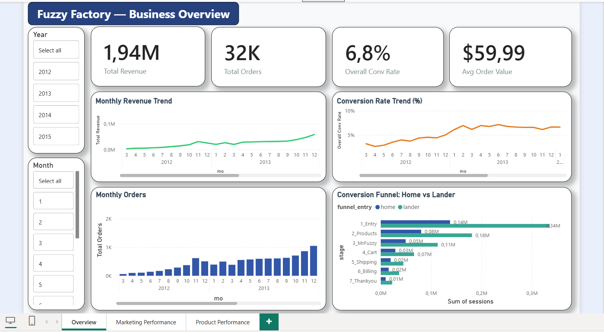
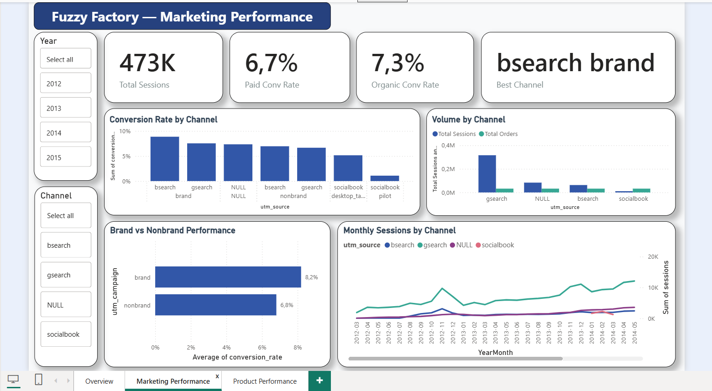
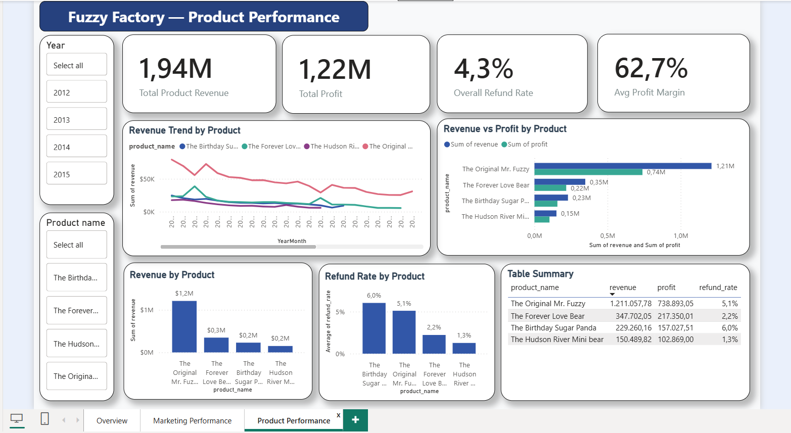

# 🧸 Fuzzy Factory — E-Commerce Analytics Project

## 📋 Project Overview
End-to-end data analysis project for Fuzzy Factory, an online teddy bear retailer. Analyzed 3 years of data (2012-2015) covering 472,871 sessions and 32,313 orders across 4 products.

***Tools:** SQL Server | Power BI  
**Dataset:** 6 tables | 36 months | Mar 2012 – Mar 2015
**Data Source:** Xóm Data - Cùng học Data Analyst / Data Engineer / Data Scientist (https://www.facebook.com/share/g/1Ejy3ak6wQ/)

---

## 🎯 Business Objective
Xác định giai đoạn có drop-off rate cao nhất để giúp business tăng conversion rate nhằm gia tăng doanh thu.

**Analytical Questions:**
- Stage nào trong funnel có drop-off rate cao nhất?
- Kênh nào (utm_source) có conversion rate cao nhất?
- Sản phẩm nào đang drive revenue chính?
- Sản phẩm nào có refund rate cao — cần investigate?

---

## 📊 Dataset
| Table | Rows | Description |
|-------|------|-------------|
| website_sessions | 472,871 | Traffic & channel data |
| website_pageviews | 1,188,124 | User behavior |
| orders | 32,313 | Transaction data |
| order_items | 40,025 | Product details |
| order_item_refunds | 1,731 | Refund records |
| products | 4 | Product catalog |

---

## 🔍 Key Findings

### 1. Growth Trend
- Conversion rate tăng từ **3.2% → 8.7%** trong 3 năm
- Revenue tăng từ **~$3K/tháng → ~$144K/tháng**
- Seasonality rõ ràng — đỉnh tháng 11-12 hàng năm

### 2. Funnel Analysis
- **Bottleneck 1 (Lander-specific):** 
  Entry→Products drop 46.1% vs 41.7% (home)
- **Bottleneck 2 (Website-wide):** 
  Product→Cart drop ~42% ở cả 2 funnels
- Potential revenue nếu fix lander: **+$49,087**

### 3. Channel Performance
- **bsearch brand:** Conv rate cao nhất (8.86%)
- **gsearch nonbrand:** Volume lớn nhất (282,706 sessions)
- **Organic/Direct:** Conv rate 7.3% > Paid 6.7%
- **Socialbook pilot:** Chỉ 1.08% — cần dừng

### 4. Product Performance
- **Mr. Fuzzy:** 62.6% total revenue, đang giảm dần
- **Sugar Panda:** Profit margin cao nhất (68.5%) 
  nhưng refund rate cao nhất (6.04%)
- Revenue tăng **5.7x** sau khi launch 3 sản phẩm mới

---

## 💡 Recommendations

| Priority | Action | Expected Impact |
|----------|--------|-----------------|
| HIGH | A/B test lander page CTA | +$49,087 revenue |
| HIGH | Dừng Socialbook pilot | Reallocate budget |
| HIGH | Tăng budget bsearch brand | Higher ROI |
| MEDIUM | Investigate Sugar Panda refunds | Protect margin |
| MEDIUM | Đầu tư SEO/organic | Free traffic |
| LOW | Diversify products | Giảm concentration risk |

---

## 📈 Dashboard

### Overview


### Marketing Performance  


### Product Performance


---

## 📁 Project Structure
\```
fuzzy-factory-ecommerce-analysis/
├── README.md
├── data/
│   └── data_dictionary.md
├── sql/
│   ├── 01_growth_trend.sql
│   ├── 02_funnel_analysis.sql
│   ├── 03_channel_performance.sql
│   ├── 04_product_performance.sql
│   └── views/
│       └── [6 view files]
├── dashboard/
│   └── screenshots/
└── insights/
    └── executive_summary.md
\```

---

## 👤 Author
Nguyen Thi Lieu  
https://www.linkedin.com/in/lieunt/
ntlieuxd2005@gmail.com
